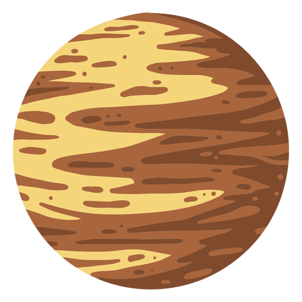

# Pluton

Pluton, autrefois considéré comme la neuvième planète du système solaire, est aujourd'hui classifié comme une planète naine.

 

## Caractéristiques

- Masse : \(1.303 \times 10^{22}\) kg
- Diamètre : 2376.6 km
- Distance au Soleil :
  - Aphélie (point le plus éloigné) : \(7.375 \times 10^{9}\) km
  - Périhélie (point le plus proche) : \(4.436 \times 10^{9}\) km
  - Demi-grand axe : \(5.906 \times 10^{9}\) km
- Symbole : &#x2647;

Pluton est connu pour sa surface glacée, composée principalement d'azote avec des traces de méthane et de monoxyde de carbone. Sa planète naine la plus proche, Charon, est si grande par rapport à Pluton qu'ils forment ensemble un système binaire, les deux corps orbitant autour d'un point de gravité commun situé dans l'espace entre eux. Pluton a une atmosphère fine qui s'étend lorsqu'elle se rapproche du Soleil et gèle lorsqu'elle s'en éloigne. Son orbite est hautement elliptique et inclinée, traversant parfois l'orbite de Neptune.